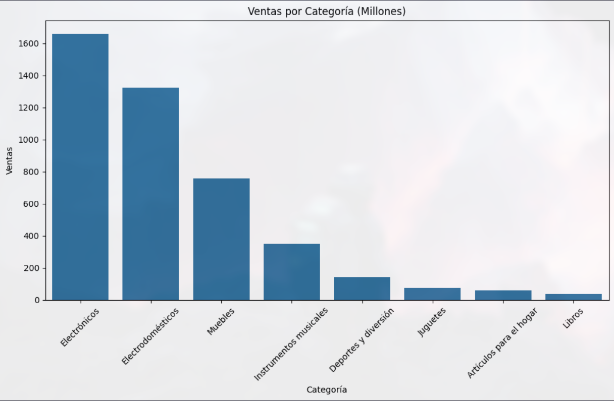
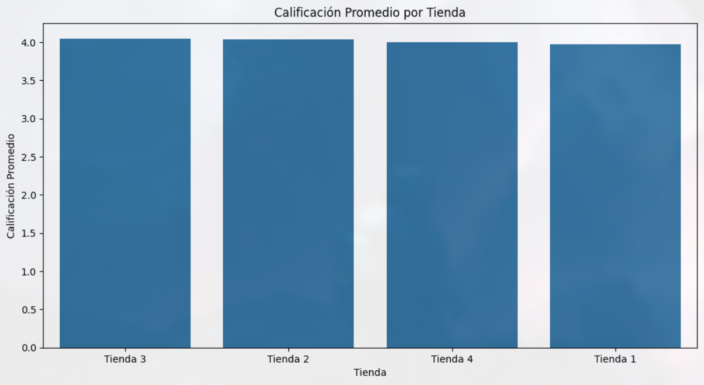

# Challenge 1: Análisis de Datos de Ventas - AluraStore Latam

## 1. Propósito del Análisis

El objetivo de este proyecto es realizar un análisis exploratorio de los datos de ventas de cuatro sucursales de la cadena "AluraStore". El propósito es consolidar la información dispersa, identificar patrones clave y extraer insights que puedan apoyar la toma de decisiones estratégicas. Esto incluye entender la facturación total, las categorías de productos más rentables, la satisfacción del cliente por tienda y los productos más y menos populares.

## 2. Estructura del Proyecto

El repositorio está organizado de la siguiente manera para facilitar la comprensión y ejecución del análisis:

```
/challenge1-data-science-latam
│
├── base-de-datos-challenge1-latam/
│   ├── tienda_1.csv
│   ├── tienda_2.csv
│   ├── tienda_3.csv
│   └── tienda_4.csv
│
├── AluraStoreLatam.ipynb
└── README.md
```

*   **`base-de-datos-challenge1-latam/`**: Contiene los archivos de datos CSV, cada uno correspondiente a una tienda.
*   **`AluraStoreLatam.ipynb`**: Es el Jupyter Notebook que contiene todo el código Python para el análisis, desde la carga y limpieza de datos hasta la visualización de resultados.

## 3. Ejemplos de Gráficos e Insights Obtenidos

A lo largo del notebook, se generan diversas visualizaciones para interpretar los datos. A continuación se muestran algunos ejemplos de los insights encontrados:

### Ventas por Categoría
Se observó que las categorías de **Electrónicos** y **Electrodomésticos** son las que generan la mayor parte de los ingresos, mientras que otras como **Libros** tienen una contribución significativamente menor.

*(Ejemplo de gráfico generado en el notebook)*


### Calificación Promedio por Tienda
El análisis de las calificaciones revela diferencias en la satisfacción del cliente entre las sucursales. La **Tienda 3** destaca por tener la calificación promedio más alta, mientras que la **Tienda 1** presenta una oportunidad de mejora. Es
importante mencionar que el margen de diferencia entre la calificacion promedio de las tiendas es muy pequeño.

*(Ejemplo de gráfico generado en el notebook)*


### Costo de Envío Promedio
Se identificó que la **Tienda 1** tiene, en promedio, los costos de envío más elevados, lo cual podría ser un factor que afecte sus ventas o la percepción del cliente.

## 4. Instrucciones para Ejecutar el Notebook

Para replicar este análisis, sigue los siguientes pasos:

**Prerrequisitos:**
*   Tener Python 3
*   Tener un entorno de Jupyter Notebook (como Jupyter Lab, Jupyter Notebook o la extensión de Jupyter en VS Code).

**Pasos:**

1.  **Clona el repositorio:**
    ```bash
    git clone https://github.com/Phylip28/challenge1-data-science-latam.git
    ```
    o si prefieres ssh:

    ```bash
    git clone git@github.com:Phylip28/challenge1-data-science-latam.git
    ```
2. **Entra al directorio del repositorio:**
    ```bash
    cd challenge1-data-science-latam
    ```

3.  **Instala las dependencias:**
    Abre una terminal y ejecuta el siguiente comando para instalar las librerías necesarias:
    ```bash
    pip install pandas matplotlib seaborn
    ```

4.  **Ejecuta el Jupyter Notebook:**
    Inicia tu entorno de Jupyter y abre el archivo `AluraStoreLatam.ipynb`. Ejecuta las celdas en orden para ver el proceso de análisis y los resultados.